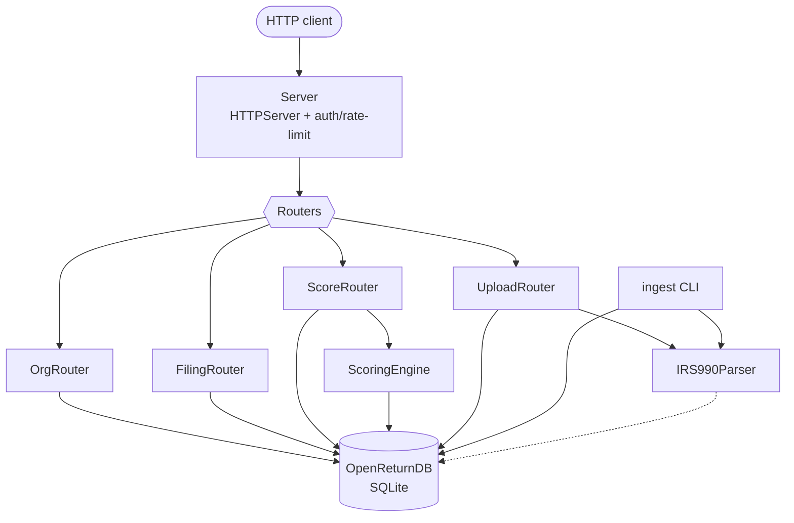
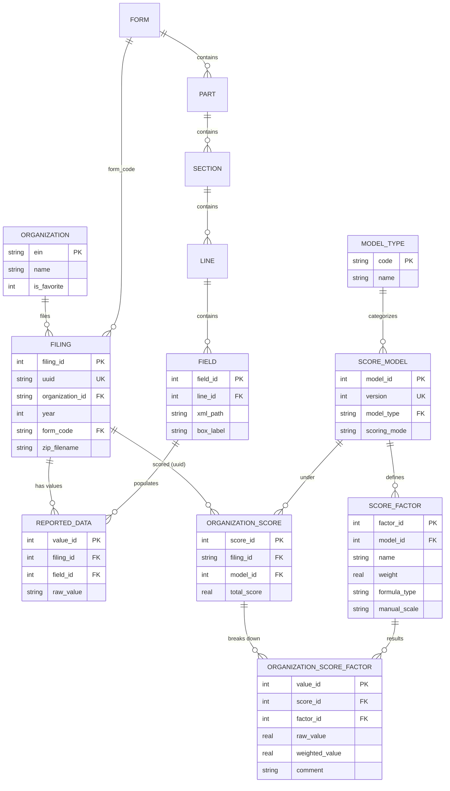
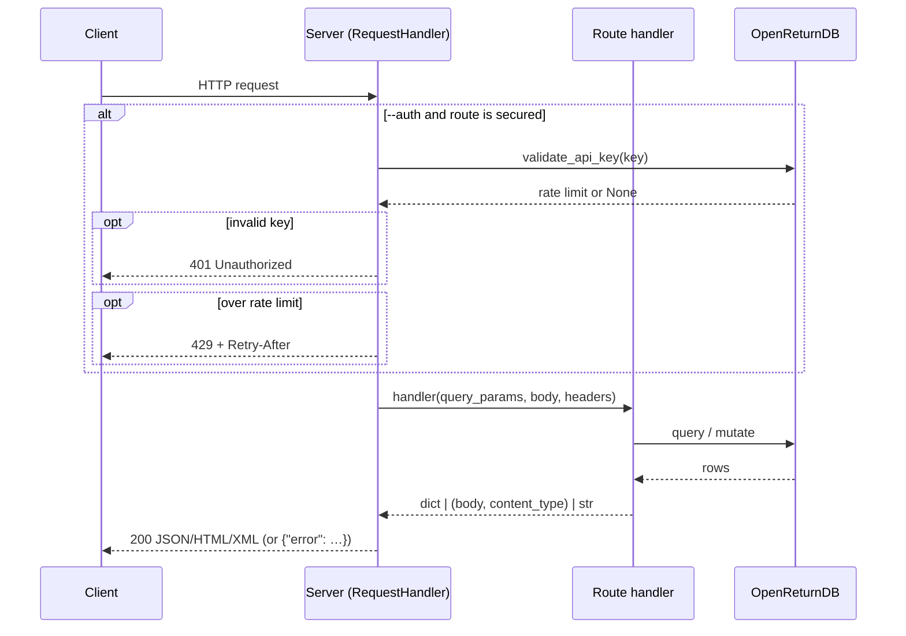

# Architecture & Development Reference

## Layer Overview

```
src/
  database/      → Database (base, connection) / OpenReturnDB (facade)
                   IRS990/repositories/ + Score/ → repository classes (composed by the facade)
                   IRS990/sql/{setup,populate,migrations}/  +  Score/sql/{setup,populate}/
  parser/        → Parser (base) / IRS990Parser
  router/        → Router (base) / UploadRouter / OrgRouter / FilingRouter / ScoreRouter
  openapi.py     → OpenAPI 3.1 spec builder (dumped to the committed openapi.json by `openreturn openapi`)
  server/        → Server (wraps HTTPServer, wires routers to routes)
  scoring/       → ScoringEngine
  unzipper/      → Unzipper (ZIP file iterator)
  sources.py     → URL detection, ZIP-link discovery, downloads (for URL ingest)
  db.py          → Database init/migrate/reset CLI commands
  ingest.py      → Bulk ZIP ingestion CLI + ingested-archive management (forget/purge) + background run
  daemon.py      → Double-fork background runner + PID-file helpers + cooperative-stop flag (ingest --background/--stop/--schedule, server single-instance via server.pid, ingest --restart-server)
  status.py      → `openreturn status` snapshot (DB size, counts, encryption, migrations, server + ingest probe)
  models.py      → Scoring model registration CLI
  keys.py        → API key management CLI
  main.py        → Server entry point
```

Each layer has a base class in its package `__init__.py` and a concrete implementation in a subpackage. The database layer is a **facade + repositories**: `database/__init__.py` exports `Database` (the connection/schema base) and `OpenReturnDB` (the facade); each concern is a repository class under `database/IRS990/repositories/` (and `database/Score/` for scoring) that the facade composes.



---

## Database Layer

### Schema (entity-relationship)

The 990 form structure (`form → part → section → line → field`) is reference data; `organization`, `filing`, and `reported_data` are the ingested data; the `score_*` tables hold scoring models and results. `reported_data.filing_id` references the integer `filing.filing_id`, while `organization_score.filing_id` references the public `filing.uuid`.



Reference/auxiliary tables not shown: `address`, `state`, `data_type`, `organization_type` (reference); `api_key`, `migration`, `ingested_zip` (operational).

### `Database` (`src/database/base.py`)

SQLite connection manager. Opens (or creates) a `.db` file and runs setup/populate scripts on init.

- `_run_dir(subdir, sql_dir)` — executes every `*.sql` in `src/database/<sql_dir>/<subdir>/` in **sorted filename order**. `__init__` runs `sql/setup/` then `sql/populate/`. SQL assets must live under the `sql/` tree of the subpackage that uses them. Numeric filename prefixes (`00_`, `10_`, …) make load order deterministic and dependency-safe.
- `begin_bulk_load()` / `end_bulk_load()` — toggle WAL mode, a 512 MB page cache, and a 10 GB mmap for high-throughput ingest. Call these around large batch operations.
- `populate_guard` — optional table name; when set, the `sql/populate/` files only run if that table is empty (used for performance-sensitive subclasses).

### `OpenReturnDB` (`src/database/openreturn.py`) — the facade

Extends `Database`. Owns the single connection and loads the schema/seed for **both** sql trees: `IRS990/sql/{setup,populate}` then `Score/sql/{setup,populate}`. `IRS990` `populate/` is split by form — `00_reference` (states, forms, parts, and the core structure), then `10_form_990`, `20_form_990ez`, `30_form_990pf`, `40_form_990t`, `50_return_header` — loaded in sorted order; the `INSERT OR IGNORE` statements cover all five supported forms (990/EZ/N/PF/T) and re-run cheaply on every startup. FK enforcement is on, so file order matters (`50_return_header` depends on part 14 from `10_form_990`). `_migrate_model_columns()` and the `api_key.rate_limit` ALTER additively migrate pre-existing databases.

Behaviour is **composed, not inherited**: the facade instantiates one repository per concern and exposes them as namespaces — the database analog of the router split. Each repository captures the facade's shared `cursor`/`connection` in `__init__(self, db)` and reaches siblings via `self._db` when a query spans concerns (e.g. `db.filings.get_filing_data_by_ein_year` joins through `db.reported_data`). Connection lifecycle — `commit`/`close`/`begin_bulk_load`/`end_bulk_load` — stays on the base `Database`. The shared `_field_meta` cache is built once on the facade; the API-key validation cache lives on `db.keys`.

| Namespace (repository) | Representative methods |
|------------------------|------------------------|
| `db.meta` (`MetadataRepository`) | `get_xpath_index()`, `get_supported_forms()`, `get_field_source()`, `drop_/restore_ingest_indexes()` |
| `db.orgs` (`OrganizationRepository`) | `list_organizations()`, `get_organization()`, `upsert_organization()`, `set_favorite()` |
| `db.filings` (`FilingRepository`) | `list_filings()`, `get_filing()`, `create_filing()`, `get_filing_data_by_ein_year()` |
| `db.reported_data` (`ReportedDataRepository`) | `get_reported_data()`, `get_historical_values()`, `store_reported_data()` |
| `db.keys` (`ApiKeyRepository`) | `create_api_key()`, `validate_api_key()`, `list_api_keys()`, `revoke_api_key()` |
| `db.migrations` (`MigrationRepository`) | `list_available_migrations()` (static), `get_applied_migrations()`, `apply_migration()` |
| `db.ingest` (`IngestRepository`) | `get_ingested_sources()`, `record_ingested_zip()`, `find_/forget_ingested_zips()` |
| `db.scores` (`ScoreRepository`) | `get_factors()`, `get_model()`, `create_score()`, `finalize_score()`, `grade_factor()`, `get_score()`, `compare_scores()`, `delete_filings_by_zip()` |

**Standalone concerns** (`db.keys`, `db.migrations`) have no FKs to the rest. The 990 data graph (`db.orgs`/`db.filings`/`db.reported_data` + the form reference tables) and `db.scores` are FK-linked and JOIN across each other, so they all share the one connection (separate databases would break joins/FKs/transactions).

**Scoring** (`db.scores`, `src/database/Score/score.py`) is a **sibling** repository, not a subclass: a model declares a `model_type` (seeded category) and a `scoring_mode` — **computed** (formula factors) or **manual** (graded by a person via `POST /scores/grade`, with a `manual_scale` + `comment`). `ScoringEngine.calculate` rejects manual models; `grade()` normalizes per `manual_scale` and recomputes the total. The purge helpers (`delete_filings_by_zip`/`delete_all_filings`) live on `db.scores` because deleting a filing must first delete its scores (`organization_score.filing_id → filing.uuid` has no cascade; `reported_data` does cascade).

**Filing keys**: `filing` has an integer `filing_id` PRIMARY KEY (rowid) and a separate `uuid UNIQUE`. **`uuid` is the public/API identifier** (filing responses, lookups, and `organization_score.filing_id` all use it). The large `reported_data` table references the integer `filing_id` — an 8-byte int rather than a 36-char uuid on ~190M rows roughly halves the DB and speeds inserts/index rebuild. `store_reported_data`/`get_reported_data` take the public uuid and resolve it internally; the bulk ingest path assigns integer ids directly.

---

## Parser Layer

### `Parser` (`src/parser/base.py`)

Generic XML DOM walker. Parses a file with `xml.etree.ElementTree`.

- `getElem(path)` — builds a namespaced XPath query from a `/`-delimited path string and returns the element's text. Tracks call counts per path in `foundElements` to cycle through repeated elements.
- `tree(depth, tagStrip)` — recursive DOM-to-dict conversion.

**Note**: `foundElements` is an **instance-level dict** (`self.foundElements`, initialized in `__init__`), so each `Parser` instance gets its own. Each XML file is parsed with a fresh `Parser()` (one per filing in `UploadRouter`/the ingest workers), so the call counts start clean per file with no need to reset shared state.

### `IRS990Parser` (`src/parser/IRS990/irs990.py`)

Extends `Parser` with the IRS namespace (`http://www.irs.gov/efile`).

- `cleanTags()` — CamelCase tag names split into space-separated words.
- `dict()` — `tree()` with namespace stripping.
- `supportedForms` — `{'990', '990EZ', '990N', '990PF', '990T'}`. Defined but not enforced at parse time; the ingest layer checks `get_supported_forms()` from the DB instead.

---

## Router Layer

### `Router` (`src/router/base.py`)

Route registry with decorator-based registration. Each router has a URL prefix and an optional template directory.

```python
class MyRouter(Router):
    def __init__(self, db):
        super().__init__(prefix='/my-prefix',
                         template_dir=str(Path(__file__).parent / 'views'))
        self._db = db
        self._register_routes()

    def _register_routes(self):
        @self.get('')           # handles GET /my-prefix
        def index(query_params, body, headers):
            return {'key': 'value'}   # dict → JSON; str → HTML

        @self.post('/create', secured=True)   # requires auth when server has --auth
        def create(query_params, body, headers):
            return self.render_template('form.html', key='value')
```

- `render_template(name, **kwargs)` — naive `{{key}}` string substitution; templates are cached on first read. Not Jinja2 — no filters, conditionals, or loops.
- Handlers receive `(query_params: dict, body: dict|None, headers: dict)`. Return a `dict` for JSON or any other value for an HTML string response.

### Concrete Routers

| Class | Prefix | Source |
|-------|--------|--------|
| `UploadRouter` | `/upload` | `src/router/Upload/upload.py` |
| `OrgRouter` | `/organizations` | `src/router/Org/org.py` |
| `FilingRouter` | `/filings` | `src/router/Filing/filing.py` |
| `ScoreRouter` | `/scores` | `src/router/Score/score.py` |

`UploadRouter` handles ZIP file upload and ingestion via `ProcessPoolExecutor`. It also exposes `process_zip_dir(path)` (used by `main.py`'s testing mode). The XPath index and supported-form set live as module-level globals (`_xpath_index`, `_supported_forms`) initialized by `_worker_init` in each worker process. Workers receive already-read XML **bytes** and do no disk/ZIP I/O; `unzipper.MemberReader` (in the main process) reads members, extracting Deflate64 archives once with `unzip` rather than per-file.

---

## Server (`src/server/server.py`)

Wraps Python's `http.server.HTTPServer`. Wires routers to routes via `include_router()`.

- `include_router(router)` — merges a router's route table into the server's global dispatch table.
- `_create_handler()` — returns a `RequestHandler` class (closure) that handles auth, rate limiting, body parsing, routing, and response serialization.
- Auth checks `Authorization: Bearer <key>` and `X-API-Key: <key>` headers when `--auth` is active.
- Rate limiter uses a sliding window (60 s) keyed by the raw API key value (not the hash).
- Request bodies up to 50 MB are accepted; larger bodies return 413.
- JSON bodies are auto-parsed; `multipart/form-data` is passed as raw bytes.
- Debug mode (`--debug`) logs every request and response with ANSI color.



---

## Scoring Engine (`src/scoring/engine.py`)

`ScoringEngine(db)` computes a financial health score for a single filing.

`calculate(ein, year, model_version)` — the main entry point:

1. Fetches the filing's field values from the DB
2. Loads the factor definitions for the model version
3. Topologically sorts factors to resolve `factor:<name>` dependencies
4. Pre-fetches historical values from the DB if any factor uses a historical formula type
5. Computes each factor's raw value via `_compute_factor()`
6. Normalizes each raw value to `[0, 1]` via `_normalize()`
7. Multiplies by weight and accumulates the total
8. Persists all factor values and the total score
9. Returns the full score record

`_topo_sort(factors)` — Kahn-style DFS that raises `ValueError` on circular or missing `factor:<name>` references.

`_resolve_input(key, vals, computed)` — resolves a single input key in priority order: `factor:<name>` → numeric literal string → field key shorthand → `None`.

See [Scoring Models](../scoring/models.md) for the full list of formula types and input keys.

---

## Ingest CLI (`src/ingest.py`)

`openreturn ingest` / `python3 src/ingest.py` processes ZIP archives from a local directory **or an `http(s)://` URL**. `cmd_ingest` dispatches on `sources.is_url`: a path goes to `_cmd_ingest_dir` (pre-scan all ZIPs → bulk-load → loop), a URL to `_cmd_ingest_url`. Both share the per-ZIP processors (`_process_zip_seq` / `_process_zip_par`) and run-level state (`_Ctx`), so the bulk-load session, worker pool, and index drop/rebuild are identical across the two paths.

**URL sources** (`src/sources.py`, stdlib `urllib` + `html.parser` only): a direct `.zip` URL is fetched as-is; any other URL is parsed as HTML and every `<a href>` whose path ends in `.zip` is kept — so on the IRS Form 990 downloads page the `apps.irs.gov` data archives are selected while CSV index files and `www.irs.gov` navigation links are ignored. Each discovered archive is downloaded to a cache dir, scanned, ingested, recorded in `ingested_zip`, then deleted (`--keep-downloads`/`--cache-dir` opt out). Archives already in `ingested_zip` are skipped unless `--force`; `--list` prints discovered URLs with their ingest status and exits. This is download→ingest→delete **per archive**, so peak disk stays bounded and an interrupted run resumes by re-doing only the in-flight archive.

**Sequential mode** (`--workers 1`): reads + processes each XML in the main process via `UploadRouter._process_xml` (full `IRS990Parser`). Simple, low-memory, easy to debug.

**Parallel mode** (`--workers N`, default = CPU count): the main process reads XML bytes (`MemberReader`) and submits them to a `ProcessPoolExecutor` in batches via `_parse_xml_batch`. Each worker (`_worker_init` once) parses bytes with a single tree-walk + XPath-index intersection and returns plain dicts. Results are collected with `as_completed`; the main process buffers and bulk-writes.

**Deduplication**: filing rows get client-assigned integer `filing_id`s (counter seeded past `MAX(filing_id)`). `_resolve_ids()` joins a temp table of the current flush's keys against `filing` to detect when an (EIN, year, form_code) triple already exists, and remaps the client id to the existing one; remaps accumulate in a per-ZIP `id_remap` applied to each batch's `reported_data`.

**Batch commits**: `_flush_zip()` writes a buffered batch and commits; it flushes per ZIP or mid-ZIP once buffered `reported_data` rows reach `_DATA_ROWS_PER_FLUSH` (500k). Indexes on `reported_data`/`filing` are dropped during the load (`drop_ingest_indexes`) and rebuilt at the end.

---

## CLI Tools

All commands are dispatched through `src/cli.py` (the unified `openreturn` binary). Each subcommand delegates to a dedicated module.

| Subcommand | Dispatch module | Purpose |
|------------|----------------|---------|
| `openreturn init` | `src/db.py` → `cmd_init` | Initialize database schema and seed data |
| `openreturn migrate` | `src/db.py` → `cmd_migrate` | Apply pending schema migrations |
| `openreturn reset` | `src/db.py` → `cmd_reset` | Delete the DB files (main + WAL + SHM) after confirmation |
| `openreturn serve` | `src/main.py` → `cmd_serve` | Start the API server (single-instance; records `server.pid`) |
| `openreturn ingest` | `src/ingest.py` → `cmd_ingest` | Bulk-ingest ZIP archives; also `--background`/`--stop` and `--ingested`/`--forget`/`--purge` management |
| `openreturn status` | `src/status.py` → `cmd_status` | DB size, row counts, encryption, migrations, server + background-ingest probe |
| `openreturn openapi` | `src/openapi.py` → `cmd_openapi` | Print/dump the OpenAPI 3.1 spec to `openapi.json` |
| `openreturn keys` | `src/keys.py` | Manage API keys |
| `openreturn models` | `src/models.py` | Register and list scoring models |

`cmd_init` opens the database (triggering the `sql/populate/` files on first run via `populate_guard="form"`), prints form/field counts, and closes. `cmd_migrate` discovers `.sql` files in `src/database/IRS990/sql/migrations/`, compares against the `migration` tracking table, and applies anything pending in filename order. `cmd_reset` deletes the DB files after a typed confirmation, refusing while a background ingest holds the database open.

`cmd_ingest` also fronts ingested-archive management: `--ingested` lists the `ingested_zip` table; `--forget PATTERN`/`--forget-all` remove tracking records only (re-ingestable); `--purge PATTERN`/`--purge-all` delete stored filing data (filings → `reported_data` cascade, plus scores deleted first since `organization_score` has no cascade). `--background` double-forks via `src/daemon.py` (PID file + log file), and `--stop` sets a cooperative stop flag (SIGTERM) so the ingest loop breaks at an archive boundary and still runs the normal index-rebuild/checkpoint finalize. `--schedule WHEN` waits until a parsed time before ingesting (relative `+30m` / clock `HH:MM` / absolute `YYYY-MM-DD HH:MM`), interruptible by `--stop`. `--restart-server` stops the single-instance server (recorded in `server.pid` by `cmd_serve`) before the run and relaunches it detached afterward; it is skipped when the server is systemd-managed. `cmd_serve` itself refuses to start a second instance while `server.pid` is live and handles SIGTERM as a clean shutdown (removing the PID file), so an external stop or `systemctl stop` is graceful. `status.py` opens the DB with a raw read connection (never running setup/populate), so it reports a clean snapshot even when an ingest holds the exclusive lock (shown as *locked*).
