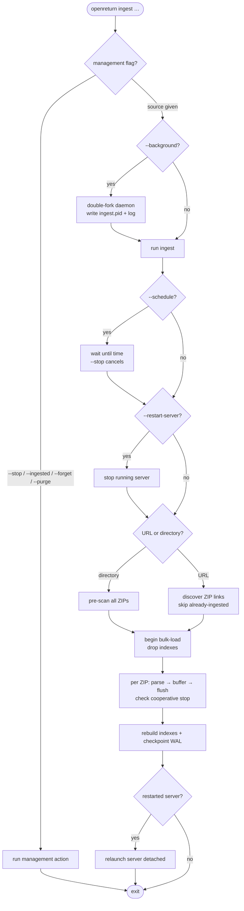

# Ingesting Form 990 Data

There are two ways to get data into OpenReturn: the **ingest CLI** for bulk loading large IRS data drops, and the **upload endpoint** for adding individual ZIPs through the browser. They use different code paths and have very different performance characteristics.

---

## The Ingest CLI

`openreturn ingest` (or `python3 src/ingest.py` in dev) is designed for the annual IRS TEOS data releases, which typically arrive as dozens of ZIP archives each containing thousands of XML filings. The source argument is either a **local directory** of `.zip` files or an **`http(s)://` URL** (see [Ingesting from a URL](#ingesting-from-a-url) below).

Flags: `--workers N` (parallel parser processes, default = CPU count) and `--profile` (print a wall-clock timer plus a per-phase breakdown — read / insert / resolve / commit / checkpoint / worker-wait — and per-ZIP `read ms/file`, for diagnosing throughput). URL sources add `--force`, `--keep-downloads`, `--cache-dir DIR`, and `--list` (all described below). `--background` runs the ingest detached (see [Running in the background](#running-ingest-in-the-background)); `--schedule` delays it until a set time (see [Scheduling an ingest](#scheduling-an-ingest)); `--restart-server` stops and restarts the API server around the run (see [Restarting the server around an ingest](#restarting-the-server-around-an-ingest)); `--ingested`, `--forget`, and `--purge` manage already-ingested archives (see [Managing ingested archives](#managing-ingested-archives)).

### Ingest flow



### Ingesting from a URL

Instead of a directory you can pass a URL. Two shapes are accepted:

- **A direct `.zip` link** — e.g. `https://apps.irs.gov/pub/epostcard/990/xml/2024/2024_TEOS_XML_01A.zip`. The archive is downloaded and ingested directly.
- **An HTML index page** — most usefully the IRS [Form 990 series downloads page](https://www.irs.gov/charities-non-profits/form-990-series-downloads). The page is fetched and every `<a href>` whose path ends in `.zip` is collected. The IRS data archives live on `apps.irs.gov`; the page's **CSV index files** (`index_YYYY.csv`) and ordinary **navigation links** end in something other than `.zip`, so they are ignored automatically. No site crawling happens — only links on the page you point at are considered.

> **Point this only at a source you trust.** Every `.zip` link on the page becomes a download target regardless of which host it lives on (the IRS page deliberately spans `www.irs.gov` → `apps.irs.gov`), and HTTP redirects are followed. Downloaded bytes are only ever written to the cache dir and parsed as 990 XML — never executed or reflected — but a compromised or spoofed index page could still direct the downloader at arbitrary hosts.

```bash
# Pull every 990-series archive the IRS currently publishes
openreturn ingest https://www.irs.gov/charities-non-profits/form-990-series-downloads

# Just one archive
openreturn ingest https://apps.irs.gov/pub/epostcard/990/xml/2024/2024_TEOS_XML_01A.zip

# See what would be fetched, and which archives are already loaded, without downloading
openreturn ingest --list https://www.irs.gov/charities-non-profits/form-990-series-downloads
```

**Already-processed archives are skipped.** Each archive that finishes ingesting is recorded in the `ingested_zip` table (keyed on its download URL). A later run discovers the same links, skips the ones already recorded, and ingests only what is new — so re-running after the IRS publishes a new month does the minimum work. The record is written only *after* an archive finishes, so an interrupted run re-does just the in-flight archive on the next pass. Pass `--force` to ingest every discovered archive regardless of the record.

**Disk is bounded.** Archives are processed one at a time: download → ingest → **delete**, so peak disk usage is roughly one archive plus the database (not the whole corpus). By default downloads go to a temporary directory that is removed afterward. Use `--cache-dir DIR` to download into a directory you control, and `--keep-downloads` to retain the `.zip` files after ingest (e.g. to keep a local mirror).

The exclusive-lock and index-rebuild behavior below applies to URL ingests exactly as it does to directory ingests — the lock is held for the whole run, and the indexes are rebuilt once at the end.

### Running ingest in the background

A full-corpus ingest can run for tens of minutes to hours. `--background` (`-b`) detaches it from your shell so it keeps running after you log out of SSH:

```bash
openreturn ingest --background https://www.irs.gov/charities-non-profits/form-990-series-downloads
# Background ingest started
#   PID     12345
#   Source  https://www.irs.gov/...
#   Log     ingest.log
```

The command double-forks into a daemon, writes its output to a log file (`ingest.log` in the working directory by default — override with `--log PATH`), records a small `ingest.pid` file, prints the PID, and returns immediately. Watch progress with `tail -f ingest.log` or `openreturn status` (which reports the running ingest). Only one background ingest may run per data directory at a time; starting a second is refused while one is active.

**Stopping is cooperative.** `openreturn ingest --stop` sends the daemon a signal; it finishes the archive it is currently on, then runs the normal finalize step (rebuild indexes + checkpoint the WAL) before exiting. This leaves the database consistent and queryable — it does **not** kill the process mid-write with indexes dropped. Because it waits for the current archive and the index rebuild, `--stop` may take a while on a large run; the command returns once the signal is delivered (watch the log for the actual exit). Archives already completed on a URL ingest are recorded, so resuming later re-does only what was unfinished.

```bash
openreturn ingest --stop          # ask the running background ingest to stop
openreturn status                 # confirm it has exited
```

Because the daemon writes `ingest.pid`/`ingest.log` in the current directory, run `--background`/`--stop` from the data directory (where `OpenReturn.db` lives). On a NixOS deployment that is `dataDir` (`/var/lib/openreturn`); see [Running ingest on a NixOS host](nixos.md#running-ingest-on-the-server) for a systemd-supervised alternative.

### Scheduling an ingest

`--schedule WHEN` delays the ingest until a chosen time — handy for running the annual IRS drop overnight. `WHEN` is one of:

- a **relative delay** — `+30s`, `+15m`, `+2h`, `+1d`
- a **clock time** — `02:00` or `02:00:30` (the next future occurrence; rolls to tomorrow if already past today)
- an **absolute datetime** — `2026-07-01 02:00` (or `2026-07-01T02:00`, optional seconds)

Pair it with `--background` so the waiting daemon doesn't hold your terminal:

```bash
openreturn ingest --background --schedule 02:00 \
  https://www.irs.gov/charities-non-profits/form-990-series-downloads
```

`openreturn status` shows a scheduled background ingest as `waiting until <time>`, and `openreturn ingest --stop` cancels it during the wait (nothing is ingested). In the foreground, `--schedule` simply blocks until the time (Ctrl-C cancels). A bad `WHEN` is rejected immediately, before anything forks.

### Restarting the server around an ingest

Because ingest takes the database's exclusive lock, a running API server gets `database is locked` errors for the duration (see [Why ingest breaks the running server](#why-ingest-breaks-the-running-server)). `--restart-server` automates the stop/start dance for the **built-in** server: it stops the running server, ingests, then relaunches the server detached with the same host/port/auth/debug it was using.

```bash
openreturn ingest --restart-server /path/to/irs-zips/
# Stopping server (PID 12345) for ingest…
# … ingest …
# Restarted server (PID 12350) on localhost:8080  → server.log
```

The server is single-instance (it records `server.pid`; a second `openreturn serve` is refused), which is what lets `--restart-server` find and manage it. This flag is for a **manually-run** server only — if the server is **systemd-managed** the flag detects that and leaves it alone (systemd would just restart it and fight the ingest); on NixOS use `systemctl stop openreturn` / `systemctl start openreturn` instead (see [Running ingest on a NixOS host](nixos.md#running-ingest-on-the-server)). `--restart-server` combines with `--schedule` and `--background`: the server is only stopped once the scheduled time arrives.

### Managing ingested archives

On a **URL** ingest each finished archive is recorded in the `ingested_zip` table (keyed on its download URL) so re-runs skip it. Two operations manage that history and the stored data:

- **Forget** removes the *tracking record* only, so the archive is re-downloaded and re-ingested on the next URL run. The stored filing data is left untouched.
- **Purge** *deletes the stored filing data* — the filings whose ZIP filename matches, plus their reported values (FK cascade) and any computed scores — and forgets the matching tracking records. This works for directory ingests too, because it matches on `filing.zip_filename`.

```bash
# Show what has been recorded as ingested
openreturn ingest --ingested

# Forget records so they re-ingest next run (PATTERN is a case-insensitive
# substring of the source URL or filename; data is kept)
openreturn ingest --forget 2023_TEOS_XML_01A
openreturn ingest --forget-all

# Delete stored data for archives whose zip filename matches PATTERN
# (filings + reported values + scores), with a confirmation prompt
openreturn ingest --purge 2023_TEOS_XML_01A
openreturn ingest --purge-all          # delete ALL filings, values, and scores

# Skip the prompt (for scripts)
openreturn ingest --purge-all --yes
```

`PATTERN` is matched literally — a `%` or `_` in the pattern is **not** a wildcard, so `2023_1` matches `2023_1.zip` but not `2023X1.zip`. Purge keeps the schema, reference/seed data, API keys, registered models, and organization rows; it only removes filing data. To wipe everything including the schema, use [`openreturn reset`](install.md#resetting-the-database) instead.

### What it does, step by step

**1. Pre-scan**

Before processing anything, the CLI opens every ZIP and counts XML members. This gives accurate progress totals upfront. Invalid ZIPs are flagged at this stage and skipped.

**2. Bulk load mode**

The CLI calls `db.begin_bulk_load()` before touching any filings. This sets three SQLite pragmas:

| Pragma | Value during ingest | Normal value |
|--------|--------------------|--------------------|
| `synchronous` | `OFF` | `NORMAL` |
| `wal_autocheckpoint` | `16000` pages (~128 MB) | `1000` pages |
| `locking_mode` | `EXCLUSIVE` | `NORMAL` |

`locking_mode=EXCLUSIVE` is the most consequential: SQLite takes an exclusive lock on the database file. **No other connection can read or write the database while ingest is running.** Any API query during this period will get a `database is locked` error.

**3. Index drop**

The three high-write-cost indexes are dropped before any rows are inserted:

- `idx_reported_data_filing` — `reported_data (filing_id)`
- `idx_reported_data_field` — `reported_data (field_id)`
- `idx_filing_org` — `filing (organization_id)`

Inserting tens of millions of rows while maintaining these B-tree indexes is many times slower than bulk-inserting and rebuilding afterward. The tradeoff is that any query running during ingest (if it somehow bypassed the lock) would fall back to full table scans.

**4. Parse and write — sequential vs. parallel**

How parsing happens depends on `--workers`:

In both modes the main process reads each XML's bytes (via `unzipper.MemberReader`, see below) — workers never do disk/ZIP I/O.

**`--workers 1` (sequential)**

Each XML is read, decoded, and processed in the main process using `router._process_xml()`. This uses the full `IRS990Parser` class (namespace-aware DOM walker). The result is written to the database immediately after each file. Slower but uses minimal memory and is easy to debug.

**`--workers N` (parallel, default: CPU count)**

A `ProcessPoolExecutor` is created once for the entire ingest run. Each worker process receives the XPath index and supported form codes via `_worker_init` and stores them as module-level globals. Workers never touch the database — they only parse.

The main process reads XML bytes and submits them in batches of `_BATCH_FILES` (50) `(xml_bytes, filename, zip_name)` tuples via `_parse_xml_batch` (batching amortizes the process-pool IPC cost). Each filing is parsed by `_parse_xml_task`, which:

1. Parses the bytes with `xml.etree.ElementTree`
2. Walks the tree **once**, building `{path: text}`, then intersects with the XPath index — far cheaper than one `ElementTree.find()` per mapped path (~56× on a real 990). First occurrence wins, matching `find()` semantics.
3. Pulls EIN, name, tax year, and form code out of the same walk
4. Returns a plain dict — no DB access, fully serializable across process boundaries

**Reading ZIP members (`unzipper.MemberReader`).** Members are read directly via `zipfile`. Some IRS TEOS archives use **Deflate64**, which Python's `zipfile` cannot decode; on the first such member `MemberReader` extracts the whole archive **once** with `unzip -d` (into tmpfs) and serves members as plain files. This replaced a per-file `unzip -p` subprocess fallback that dominated full-corpus ingest (88.7% of wall-clock → 10.2%; full 731k-filing run 1h45m → ~20m).

The main process collects results via `as_completed`, buffers organizations, filings, and field values in memory, and flushes to the DB via `_flush_zip()` (per ZIP, or mid-ZIP once buffered `reported_data` rows reach `_DATA_ROWS_PER_FLUSH`):

```
_flush_zip():
  INSERT OR IGNORE INTO organization …
  INSERT OR IGNORE INTO filing (filing_id, uuid, …)   -- explicit integer filing_id
  _resolve_ids() → detect collisions with existing rows (this batch only)
  apply the persistent per-ZIP id_remap to pending_data
  INSERT OR IGNORE INTO reported_data …               -- integer filing_id
  db.commit()
```

Integer filing_ids are assigned client-side from a counter seeded past `MAX(filing_id)` (so `reported_data` rows can be built before the filing rows are inserted; `reported_data.filing_id` is the integer rowid, not the uuid — see the schema note in [architecture](development/architecture.md)). `_resolve_ids()` handles the case where a filing for the same (EIN, year, form code) already exists: it joins a temp table of **the current batch's** keys against `filing` and returns a remap of the client-assigned id to the existing one. Those remaps accumulate in a per-ZIP `id_remap` dict that is applied to every batch's `pending_data`, so a within-ZIP duplicate whose data lands in a later flush is still remapped correctly. (`uuid` remains the public/API filing identifier.)

**5. Teardown**

After all ZIPs are processed:

1. `db.restore_ingest_indexes()` — rebuilds the three dropped indexes (heavy write, may take minutes on large datasets)
2. `db.end_bulk_load()` — restores normal locking mode, runs `PRAGMA optimize` (updates query planner statistics), and runs `PRAGMA wal_checkpoint(TRUNCATE)` to merge the WAL file back into the main database file and zero out the WAL

---

## The Upload Endpoint

`POST /upload` accepts a `multipart/form-data` request containing a ZIP file. This is the browser-based path for adding individual data files.

### What it does

1. Parses the `multipart/form-data` boundary manually and extracts the ZIP bytes from the request body (no disk write — the ZIP stays in memory as a `BytesIO`)
2. Opens the in-memory ZIP and iterates over XML members
3. For each XML: calls `_process_xml()` — parses with `IRS990Parser`, upserts the organization, creates the filing record, stores all field values, and returns a result dict
4. Calls `db.commit()` once at the end
5. Returns a summary `{status: "complete", stored, errors, results}`

**Key differences from the CLI:**

| | CLI ingest | Upload endpoint |
|---|---|---|
| Parsing | Worker processes (`ET` direct) | Main process (`IRS990Parser`) |
| DB writes | Buffered per ZIP, flushed in batch | Immediate after each XML |
| Bulk load mode | Yes (exclusive lock, no indexes) | No |
| Index management | Drop before, rebuild after | Indexes always present |
| Commit strategy | Per ZIP + final checkpoint | Single commit at end of request |
| Concurrent API access | Blocked | Allowed (but contended) |

The upload endpoint commits everything in a single transaction. For a ZIP with thousands of XMLs this means the transaction stays open for the full duration of the request, which can cause write contention with other API routes.

---

## Why Ingest Breaks the Running Server

Running `openreturn ingest` while the API server is up will cause the server to return errors for the duration of the ingest run.

**Exclusive lock**

`PRAGMA locking_mode=EXCLUSIVE` means only one connection can hold the database at a time. SQLite's WAL mode does allow concurrent readers in normal operation, but exclusive locking mode overrides that — it prevents any new readers from opening the file. The API server's connection pool will see `sqlite3.OperationalError: database is locked` on the first query after the lock is acquired.

**Missing indexes**

Even if a query somehow succeeded (e.g., on a connection established before the lock), the three dropped indexes cover the most common query patterns: looking up filings by organization, reported data by filing, and reported data by field. Without them, every query against `reported_data` (the largest table by far) requires a full scan. On a database with tens of millions of rows this turns sub-millisecond queries into multi-second ones.

**CPU and memory saturation**

Parallel ingest with the default worker count (equal to CPU count) fully saturates the CPU. The server's Python process competes for time on every incoming request. Worker processes also each hold a copy of the XPath index and XML data in memory; on a machine with many cores this can push available memory low enough to trigger the OOM killer.

**WAL growth**

With `wal_autocheckpoint` raised to 16000 pages, the WAL file is not checkpointed back to the main database until it reaches ~128 MB. During the final `wal_checkpoint(TRUNCATE)` the database is briefly unavailable again while the WAL is merged. If the server is running, requests during this window also fail.

---

## Running Ingest Safely

**Schedule it after hours.** All normal API traffic should be finished before starting a bulk ingest. The exclusive lock lasts for the full ingest run, which depending on dataset size and hardware can range from a few minutes to several hours.

**Stop the server first (recommended).** If the server process holds an open connection to the database when `locking_mode=EXCLUSIVE` is set, SQLite may time out before acquiring the lock, leaving ingest in an indeterminate state. The cleanest approach:

```bash
# NixOS managed service
systemctl stop openreturn
openreturn ingest /path/to/irs-zips/
systemctl start openreturn

# Dev / manual — let ingest stop and restart the built-in server for you
openreturn ingest --restart-server /path/to/irs-zips/
```

For a manually-run server, [`--restart-server`](#restarting-the-server-around-an-ingest) handles the stop/start automatically (it is skipped for a systemd-managed server, where `systemctl` is the right tool).

**Use parallel mode for large datasets.** The default (`--workers` = CPU count) is significantly faster than `--workers 1` for large IRS drops because XML parsing is CPU-bound and fully parallelizes. The database write phase is single-process regardless of worker count, so doubling workers roughly doubles parse throughput up to the point where DB writes become the bottleneck.

**Expect index rebuild time.** After all ZIPs are processed the CLI prints `Rebuilding indexes…` and `Checkpointing WAL…`. These steps can take several minutes on large databases and cannot be interrupted cleanly — let them finish before starting the server again.

---

## Upload Endpoint Caveats

The `/upload` endpoint is convenient for small one-off additions but is not designed for large data drops:

- **No bulk load mode.** Indexes stay up, `synchronous=NORMAL`, normal locking — safe for concurrent access but slow for bulk writes.
- **Single-threaded.** Every XML is parsed and written in sequence in the main server process. A ZIP with 10,000 XMLs will block the HTTP handler for the full duration, causing timeouts on any other requests made during that window.
- **50 MB request limit.** The server enforces a hard limit on request body size. IRS TEOS ZIPs are typically hundreds of megabytes and will be rejected.
- **In-memory ZIP.** The entire ZIP body is held in memory for the duration of the request. Large ZIPs increase the server's memory footprint for that request.

For anything beyond a handful of filings, use the CLI instead.
