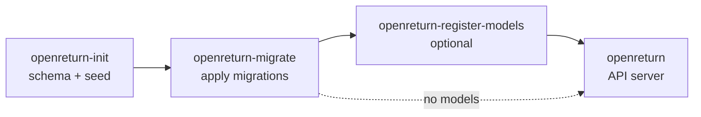

# NixOS Module

OpenReturn ships a NixOS module. Add the flake as an input and enable the service:

```nix
# flake.nix
{
  inputs = {
    nixpkgs.url = "github:NixOS/nixpkgs/nixpkgs-unstable";
    openreturn = {
      url = "github:CalamooseLabs/OpenReturn";
      inputs.nixpkgs.follows = "nixpkgs";
    };
  };

  outputs = { nixpkgs, openreturn, ... }: {
    nixosConfigurations.myhost = nixpkgs.lib.nixosSystem {
      system = "x86_64-linux";
      modules = [
        openreturn.nixosModules.default
        {
          services.openreturn = {
            enable = true;
            host   = "0.0.0.0";
            port   = 8080;
          };
        }
      ];
    };
  };
}
```

## Module Options

| Option | Type | Default | Description |
|--------|------|---------|-------------|
| `enable` | bool | `false` | Enable the service |
| `package` | package | flake default | Override the openreturn package |
| `host` | string | `"localhost"` | Bind address |
| `port` | port | `8080` | Bind port |
| `debug` | bool | `false` | Verbose request/response logging |
| `dataDir` | string | `"/var/lib/openreturn"` | Directory where `OpenReturn.db` is stored |
| `user` | string | `"openreturn"` | Service user |
| `group` | string | `"openreturn"` | Service group |
| `runAsRoot` | bool | `false` | Run as root instead of the dedicated service user (not recommended) |
| `openFirewall` | bool | `true` | Open the firewall for the configured port |
| `auth` | bool | `false` | Require API key authentication for all requests |
| `database.secretKeyFile` | null or path | `null` | Path to a file holding the SQLCipher key; loaded at runtime via systemd credentials (never in the store). See [Database Encryption](#database-encryption) |
| `database.secretKey` | null or string | `null` | SQLCipher key as a literal string (**insecure** — lands in the Nix store). Prefer `secretKeyFile` |
| `models` | list of model submodules | `[]` | Scoring models to register automatically (see below) |

## Scoring Models

Define scoring models directly in your NixOS configuration. Each model is written to a TOML file in the Nix store and registered by a one-shot systemd service (`openreturn-register-models.service`) that runs before the API server starts.

```nix
services.openreturn = {
  enable = true;
  models = [
    {
      version     = 1;
      description = "Initial financial health model";
      factors = [
        {
          name               = "Program Efficiency";
          weight             = 0.40;
          formula_type       = "ratio";
          inputs             = [ "prog" "total_exp" ];
          direction          = "higher";
          benchmark_lo       = 0.50;
          benchmark_hi       = 0.85;
          formula_description = "Program expenses as a share of total expenses";
        }
        {
          name         = "Expense Growth";
          weight       = 0.30;
          formula_type = "growth";
          inputs       = [ "cy_exp" "py_exp" ];
          direction    = "lower";
          benchmark_lo = 0.0;
          benchmark_hi = 0.15;
        }
        {
          name         = "Revenue Stability";
          weight       = 0.30;
          formula_type = "coefficient_of_variation";
          inputs       = [ "cy_rev" ];
          direction    = "lower";
          benchmark_lo = 0.0;
          benchmark_hi = 0.5;
        }
      ];
    }
  ];
};
```

### Model fields

| Field | Type | Required | Description |
|-------|------|----------|-------------|
| `version` | positive int | yes | Unique model version; bump to register a new model |
| `description` | string or null | no | Human-readable description |
| `type` | string or null | no | Category — a seeded `model_type` code (`financial`, `governance`, `whole_person`, `christ_centeredness`) |
| `mode` | `"computed"` or `"manual"` | no (default `"computed"`) | `computed` = formula factors; `manual` = human-graded factors (set each factor's `scale`) |
| `factors` | list | yes | The factors (fields below) |

### Factor fields

| Field | Type | Required | Description |
|-------|------|----------|-------------|
| `name` | string | yes | Unique factor name; used in `factor:<name>` references |
| `weight` | number | yes | Contribution weight (≥ 0); set to `0` for intermediate factors |
| `formula_type` | string or null | computed only | Formula type — see [Scoring Models](scoring/models.md) for the full list |
| `inputs` | list of strings or null | computed only | Ordered input keys, numeric literals, or `factor:<name>` references |
| `scale` | `"benchmark"`/`"normalized"`/`"percent"` or null | manual only | How a grader's value maps to `[0,1]` (see [Manual Models](scoring/models.md#manual-graded-models)) |
| `direction` | `"higher"` or `"lower"` or null | computed, or manual with `scale = "benchmark"` | Which end of the benchmark range scores best |
| `benchmark_lo` | number or null | as above | Lower bound for normalization |
| `benchmark_hi` | number or null | as above | Upper bound (must be > `benchmark_lo`) |
| `formula_description` | string or null | no | Description (computed) or grader guidance (manual) |

A **manual** (graded) model omits `formula_type`/`inputs` and sets `scale` per factor:

```nix
{
  version = 5;
  type    = "governance";
  mode    = "manual";
  factors = [
    { name = "Board Independence"; weight = 0.5; scale = "percent";
      formula_description = "What share of voting board members are independent?"; }
    { name = "Conflict-of-Interest Policy"; weight = 0.5; scale = "benchmark";
      direction = "higher"; benchmark_lo = 1; benchmark_hi = 5;
      formula_description = "Rate 1–5 the strength of the policy."; }
  ];
}
```

Manual-model factors are then scored through the [grading API](api.md#post-scoresgrade), not computed.

### How model registration works

When `models` is non-empty, the module creates `openreturn-register-models.service`:

- **Type = oneshot, RemainAfterExit = true** — runs once, stays "active" so the API server knows it completed
- Runs **after** `openreturn-migrate.service` and **before** `openreturn.service`; the API server will not start until registration is done
- For each model, runs `openreturn models register --skip-existing <toml-file>` — if the version is already in the database the step is silently skipped, making redeployment safe
- Uses the same user, group, and `dataDir` as the main service

### Updating a model

Model versions are immutable once registered — changing a factor's formula without bumping the version has no effect (the existing DB row is kept). To deploy updated factors:

1. Bump `version` (e.g. `version = 2`)
2. Run `nixos-rebuild switch`

The registration service will register the new version. The old version remains in the database and any scores computed under it are preserved. Use `GET /scores/compare?ein=...&year=...` to see results under both versions side by side.

## Systemd Service Chain



The module creates up to four services that run in dependency order before the API server starts:

| Service | What it does |
|---------|-------------|
| `openreturn-init.service` | Initializes the database schema and seeds form definitions (990, 990-EZ, 990-N, 990-PF, 990-T). No-op if already initialized. |
| `openreturn-migrate.service` | Applies any pending schema migrations from the migration log. Safe to run on every deploy. |
| `openreturn-register-models.service` | Registers scoring models declared in `cfg.models`. Only present when `models != []`. |
| `openreturn.service` | The HTTP API server. Starts only after all of the above complete. |

All three setup services use `Type = oneshot; RemainAfterExit = true` so systemd treats them as "active" once complete and only re-runs them if the unit is explicitly reset.

## Security Hardening

The service runs as a dedicated system user with a hardened systemd unit:

- `PrivateTmp = true`
- `ProtectSystem = strict`
- `NoNewPrivileges = true` (when `port >= 1024`)

When `port < 1024` (e.g. `port = 80`) the unit instead grants `CAP_NET_BIND_SERVICE` via `AmbientCapabilities` and locks the capability bounding set to that single capability. The process can bind the privileged port without running as root and without being able to acquire any other capability.

The database file is written to `dataDir`, which is managed by systemd's `StateDirectory` directive.

## Database Encryption

Providing an encryption key turns on SQLCipher (AES-256) encryption of `OpenReturn.db`. The packaged build includes the `sqlcipher3` binding, so no extra setup is needed. The key is injected into **every** unit that touches the database (`init` creates it encrypted; `migrate`, `register-models`, and the server open it), so set the key once and the whole chain uses it.

There are two ways to supply the key, designed to fit however your host manages secrets.

### `database.secretKeyFile` (recommended)

Point at a file whose contents are the key. The module loads it through systemd's `LoadCredential`, so the secret is exposed to the service as `$CREDENTIALS_DIRECTORY/db-secret-key` (mode `0400`, owned by the service user) and **never lands in the Nix store** or in `systemctl show`. This composes with any secret manager that can drop a file on the host:

```nix
# agenix
services.openreturn.database.secretKeyFile = config.age.secrets.openreturn-db.path;

# sops-nix
services.openreturn.database.secretKeyFile = config.sops.secrets.openreturn-db.path;

# plain file you provisioned out of band (must be readable by the service user)
services.openreturn.database.secretKeyFile = "/run/secrets/openreturn-db-key";
```

Under the hood the module sets, on each unit:

```ini
LoadCredential=db-secret-key:/run/secrets/openreturn-db-key
Environment=DB_SECRET_KEY_FILE=%d/db-secret-key   # %d = the credentials dir
```

and the app reads the key from that file via `DB_SECRET_KEY_FILE`.

### `database.secretKey` (testing only)

A literal string, injected as `Environment=DB_SECRET_KEY=…`. **This is insecure**: the value is written world-readable into the Nix store and shown by `systemctl show`. The module emits a build-time warning when it is used. Reserve it for throwaway or local testing:

```nix
services.openreturn.database.secretKey = "dev-only-passphrase";
```

Setting both `secretKeyFile` and `secretKey` is a configuration error (assertion failure). If neither is set, the database is unencrypted.

> The key must stay stable across deploys — SQLCipher cannot open a database created with a different key. To rotate it you must re-key or re-create the database out of band.

## Restart Behaviour

The unit restarts automatically on failure with a 5-second delay between attempts. The start-limit window is disabled (`StartLimitIntervalSec = 0`), so systemd does **not** give up after a burst of failures — it keeps retrying every 5 seconds. (An activation script clears any prior failed/rate-limited state on each `nixos-rebuild switch` so configuration changes always take effect immediately.)

```bash
# Inspect what went wrong
journalctl -u openreturn -n 50

# Clear the failure state and try again
systemctl reset-failed openreturn
systemctl start openreturn
```

Deploying a new version via `nixos-rebuild switch` automatically restarts the service.

## Running ingest on the server

A bulk ingest takes the database's exclusive lock for its whole run, so the API server should be stopped first (see [Running Ingest Safely](ingest.md#running-ingest-safely)). Because an ingest can run for hours, you want it detached from your SSH session. There are two ways:

**Built-in background mode** — works the same on the server as in development:

```bash
cd /var/lib/openreturn                 # the dataDir; ingest.pid/ingest.log land here
sudo systemctl stop openreturn
sudo -u openreturn openreturn ingest --background \
  https://www.irs.gov/charities-non-profits/form-990-series-downloads
sudo -u openreturn openreturn status   # watch progress
# tail -f /var/lib/openreturn/ingest.log
sudo -u openreturn openreturn ingest --stop   # cooperative stop when needed
sudo systemctl start openreturn
```

Run it as the service user so the log/PID files and any database writes have the right ownership. If the database is encrypted, that shell needs the key too — export `DB_SECRET_KEY_FILE=<path>` (the same file `database.secretKeyFile` points at) before invoking. Do **not** rely on `openreturn ingest --restart-server` here — it detects the systemd-managed server and deliberately leaves it for systemd, so use `systemctl stop/start` (above) to bracket the ingest.

**Transient systemd unit** — supervised by systemd, with output in the journal:

```bash
sudo systemctl stop openreturn
sudo systemd-run --unit=openreturn-ingest \
  --uid=openreturn --gid=openreturn \
  --working-directory=/var/lib/openreturn \
  --setenv=DB_SECRET_KEY_FILE=/run/secrets/openreturn-db-key \
  /run/current-system/sw/bin/openreturn ingest \
  https://www.irs.gov/charities-non-profits/form-990-series-downloads

journalctl -u openreturn-ingest -f      # follow output
systemctl stop openreturn-ingest        # SIGTERM → cooperative stop (finishes current archive, then finalizes)
sudo systemctl start openreturn
```

Drop the `--setenv=DB_SECRET_KEY_FILE=…` line if the database is unencrypted. `systemctl stop` sends `SIGTERM`, which triggers the same cooperative stop as `openreturn ingest --stop`.

## Managing Keys on a NixOS Host

The `openreturn keys`, `openreturn models`, `openreturn status`, and `openreturn reset` subcommands expect to run from the directory where `OpenReturn.db` lives (`dataDir`, default `/var/lib/openreturn`):

```bash
cd /var/lib/openreturn
openreturn keys create "Dashboard"
openreturn models register /path/to/model_v1.toml
openreturn status                       # DB size, row counts, server + ingest state
```

See [API Keys](api-keys.md) and [Scoring Models](scoring/models.md) for full CLI reference.
