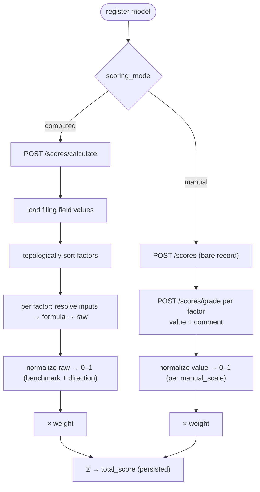

# Scoring Models

Scores represent a financial health assessment of a Form 990 filing under a versioned scoring model. Models are defined as TOML files and registered with the `openreturn models` CLI.

## How a score is produced

A **computed** model is evaluated automatically from 990 data; a **manual** model is graded by a person. Both end in `total = Σ (normalized × weight)`.



## CLI

Run from the directory where `OpenReturn.db` lives:

```bash
openreturn models register model_v1.toml          # validate and write to DB
openreturn models register model_v1.toml --dry-run  # validate only, no DB write
openreturn models list                             # list all registered versions
```

## TOML Format

```toml
[model]
version     = 1
description = "Initial financial health model"   # optional

[[factor]]
name               = "Program Efficiency"
weight             = 0.30
formula_type       = "ratio"
inputs             = ["prog", "total_exp"]
direction          = "higher"
benchmark_lo       = 0.50
benchmark_hi       = 0.85
formula_description = "Program expenses as a share of total expenses"  # optional

[[factor]]
name         = "Expense Growth"
weight       = 0.20
formula_type = "growth"
inputs       = ["cy_exp", "py_exp"]
direction    = "lower"
benchmark_lo = 0.0
benchmark_hi = 0.15
```

### Factor fields

| Field | Required | Description |
|-------|----------|-------------|
| `name` | yes | Unique label (used in `factor:<name>` references) |
| `weight` | yes | Contribution to total score; must be ≥ 0. Set to `0` for intermediate factors. |
| `formula_type` | yes | One of the types listed below |
| `inputs` | yes | Ordered list of input keys (field keys, numeric literals, or `factor:<name>`) |
| `direction` | yes | `"higher"` or `"lower"` — which end of the benchmark range scores best |
| `benchmark_lo` | yes | Lower bound for normalization |
| `benchmark_hi` | yes | Upper bound for normalization; must be > `benchmark_lo` |
| `formula_description` | no | Human-readable description of what the formula measures |

**Weights** should sum to `1.0` — a warning is printed if they don't, but it is not an error. Weights of `0` are allowed and do not contribute to the total score (useful for intermediate factors).

## Model Types & Modes

Each model declares a **type** (its subject area) and a **mode** (how its factors are scored):

```toml
[model]
version = 5
type    = "governance"   # category — must be a seeded model_type code
mode    = "manual"       # "computed" (default) or "manual"
description = "Board governance review"
```

`type` is one of the seeded categories (validated at registration; list them with `GET /scores/types`):

| `type` | Meaning |
|--------|---------|
| `financial` | Quantitative financial ratios computed from 990 data |
| `governance` | Board composition, policies, and oversight |
| `whole_person` | Holistic organizational and staff well-being |
| `christ_centeredness` | Mission and faith alignment |

To add a new category, insert a row into the `model_type` table (seeded in `Score/sql/setup`). `type` defaults to unset; pre-existing models are treated as `financial`.

`mode` is either:

- **`computed`** (default) — every factor is evaluated from a formula over 990 data (the formula types below). This is the original behavior.
- **`manual`** — every factor is **graded by a person**: a value + an optional comment supplied through the [grading API](#manual-graded-models). A model is wholly one or the other.

## Manual (Graded) Models

A manual model's factors have no formula or inputs. Instead each factor declares a `scale` that says how the grader's entered value maps to `[0, 1]`, and `formula_description` carries the **guidance** shown to the grader:

```toml
[model]
version = 5
type    = "governance"
mode    = "manual"

[[factor]]
name   = "Board Independence"
weight = 0.5
scale  = "percent"                 # grader enters 0–100
formula_description = "What share of voting board members are independent?"

[[factor]]
name         = "Conflict-of-Interest Policy"
weight       = 0.5
scale        = "benchmark"         # grader enters a raw rating, normalized via the benchmark
direction    = "higher"
benchmark_lo = 1
benchmark_hi = 5
formula_description = "Rate 1–5 the strength of the conflict-of-interest policy."
```

`scale` is one of:

| `scale` | Grader enters | Maps to [0,1] as |
|---------|---------------|------------------|
| `percent` | 0–100 | `value / 100` (clamped) |
| `normalized` | a value already in 0–1 | `value` (clamped) |
| `benchmark` | a raw rating | normalized via `benchmark_lo`/`benchmark_hi` + `direction`, exactly like a computed factor |

### Grading

Create a score for the filing, then grade each factor:

```bash
# 1. create the score record (manual model version 5)
POST /scores            { "filing_id": "<uuid>", "model_version": 5 }   → { "score_id": 12, ... }

# 2. grade each factor (repeatable; upserts and recomputes the total each call)
POST /scores/grade      { "score_id": 12, "factor_id": 30, "value": 80, "comment": "2 insiders of 9" }
```

Each `POST /scores/grade` stores the value + comment, normalizes it per the factor's `scale`, multiplies by the weight, and recomputes the score's `total_score` from all graded factors. `GET /scores/detail?score_id=12` (and `GET /scores/debug`) return each factor's value, comment, and weighted contribution. `POST /scores/calculate` is rejected for a manual model (there is nothing to compute). See [the API reference](../api.md#post-scoresgrade) for the full request/response shapes.

## Formula Types

### Fixed-input formulas

| `formula_type` | Inputs | Formula | Returns None when |
|----------------|--------|---------|-------------------|
| `ratio` | `[n, d]` | `n / d` | `d = 0` |
| `ratio_positive` | `[n, d]` | `n / d` | `d ≤ 0` |
| `growth` | `[cy, py]` | `cy / py − 1` | `py = 0` |
| `difference` | `[a, b]` | `a − b` | either input missing |
| `product` | `[a, b]` | `a × b` | either input missing |
| `clamp` | `[v, lo, hi]` | `max(lo, min(hi, v))` | any input missing |
| `abs_value` | `[a]` | `\|a\|` | input missing |
| `inverse` | `[a]` | `1 / a` | `a = 0` |
| `working_capital` | `[cash, savings, accts_pay, total_exp]` | `(cash + savings − payable) / exp` | `exp = 0` |
| `sum_ratio` | `[a, b, d]` | `(a + b) / d` | `d = 0` or either numerator missing |

### Variable-length formulas (1+ inputs; `None` values are skipped)

| `formula_type` | Formula |
|----------------|---------|
| `sum` | `a + b + …` |
| `average` | `mean(a, b, …)` |
| `min` | `min(a, b, …)` |
| `max` | `max(a, b, …)` |
| `median` | median of inputs (even-length: average of two middle values) |

All variable-length types require at least 1 input; zero inputs is a validation error.

### Historical formulas (1 field-key input; operate over all available filing years for the org)

| `formula_type` | Formula | Returns None when |
|----------------|---------|-------------------|
| `running_average` | mean of field across all years | no history |
| `cumulative_sum` | sum of field across all years | no history |
| `historical_min` | minimum across all years | no history |
| `historical_max` | maximum across all years | no history |
| `cagr` | `(last / first)^(1 / (n−1)) − 1` | < 2 years, or either endpoint ≤ 0 |
| `historical_std_dev` | population standard deviation | no history |
| `coefficient_of_variation` | `std_dev / \|mean\|` | no history, or mean = 0 |

Historical formulas take exactly 1 input — a field key (not `factor:<name>`). The engine fetches all available years for the organization on first use and caches the result for the duration of the scoring call.

## Input Keys

### IRS Form 990 field keys

| Key | Form 990 field |
|-----|----------------|
| `prog` | Program services expenses |
| `admin` | Management & general expenses |
| `fund` | Fundraising expenses |
| `total_exp` | Total functional expenses |
| `cy_exp` | Current year total expenses |
| `py_exp` | Prior year total expenses |
| `cy_rev` | Current year total revenue |
| `cy_grants` | Current year grants paid |
| `py_grants` | Prior year grants paid |
| `contrib` | Total contributions |
| `gov_grants` | Government grants |
| `invest_inc` | Investment income |
| `assets` | Total assets (EOY) |
| `liabilities` | Total liabilities (EOY) |
| `equity` | Net assets / fund balances (EOY) |
| `cash` | Cash (EOY) |
| `savings` | Savings & temp cash investments (EOY) |
| `invest_val` | Other investments (EOY) |
| `accts_pay` | Accounts payable & accrued expenses (EOY) |

### Other input types

| Syntax | Example | Resolves to |
|--------|---------|-------------|
| `factor:<name>` | `factor:Expense Ratio` | Raw computed value of a previously evaluated factor |
| numeric literal | `"0"`, `"1.0"`, `"-0.5"` | The literal float value |

Numeric literals are useful for `clamp` bounds: `inputs = ["cy_rev", "0", "1000000"]`.

## Normalization

Each raw factor value is mapped to `[0, 1]` using the factor's benchmark range:

- `direction = "higher"`: `clamp((raw − lo) / (hi − lo), 0, 1)`
- `direction = "lower"`: `clamp((hi − raw) / (hi − lo), 0, 1)`

If the raw value is `None` (formula returned no result), the normalized value is `0.0`.

The final score is the sum of all `normalized × weight` values. If weights sum to 1.0 the total score is in `[0, 1]`.

## Debugging a Score (walkthrough)

`GET /scores/debug?ein=<ein>&year=<year>&version=<v>` (or `?filing_id=<uuid>`) returns a full, read-only trace of how a score is produced — without persisting anything. For each factor it gives:

- **`formula.expression`** — the formula with variable names, e.g. `prog / total_exp`
- **`formula.substituted`** — the same formula with this filing's numbers, e.g. `812000 / 950000` (a missing input shows as `None`, and `formula.computable` is `false`)
- **`variables`** — every input resolved: field keys carry a `source` block tracing the value back to its **form, part, section, line, column, box label, and `xml_path`** (and `field_id`); numeric literals and `factor:<name>` references are labelled by `kind`
- **`normalization`** — the `clamp01(...)` expression with `benchmark_lo`/`benchmark_hi` substituted, the resulting `normalized` value, and the `weighted_value` contribution

This is the data a frontend uses to let someone click a score open and walk it all the way back to the line on the 990. See [`GET /scores/debug`](../api.md#get-scoresdebug) for the full response shape. The numbers match `POST /scores/calculate` exactly — `debug` reuses the same evaluation, it just records the intermediate steps instead of persisting the result.

## Intermediate (Derived) Factors

A factor can reference another factor's raw (pre-normalization) value using `factor:<name>`. Set `weight = 0` on the upstream factor so it is computed and stored but does not contribute to the total score.

```toml
[[factor]]
name         = "Expense Ratio"
weight       = 0.0                    # computed but excluded from total
formula_type = "ratio"
inputs       = ["prog", "total_exp"]
direction    = "higher"
benchmark_lo = 0.5
benchmark_hi = 0.85

[[factor]]
name         = "Adjusted Efficiency"
weight       = 0.30
formula_type = "ratio"
inputs       = ["factor:Expense Ratio", "cy_rev"]
direction    = "higher"
benchmark_lo = 0.0
benchmark_hi = 0.001
```

Factors are evaluated in dependency order automatically. Circular references are caught at registration time and rejected.
