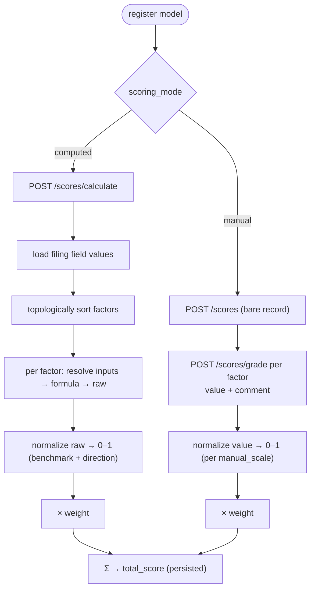

# Scoring Models

Scores represent a financial health assessment of a Form 990 filing under a versioned scoring model. Models are defined as TOML files and registered with the `openreturn models` CLI.

## How a score is produced

A **computed** model is evaluated automatically from 990 data; a **manual** model is graded by a person. Both end in `total = Σ (normalized × weight)`.


```mermaid
flowchart TD
  reg([register model]) --> mode{scoring_mode}
  mode -->|computed| calc["POST /scores/calculate"]
  calc --> load[load filing field values]
  load --> topo[topologically sort factors]
  topo --> cf["per factor: resolve inputs → formula → raw"]
  cf --> normc["normalize raw → 0–1 (benchmark + direction)"]
  normc --> wc["× weight"]
  wc --> total["Σ → total_score (persisted)"]
  mode -->|manual| create["POST /scores (bare record)"]
  create --> grade["POST /scores/grade per factor<br/>value + comment"]
  grade --> normm["normalize value → 0–1 (per manual_scale)"]
  normm --> wm["× weight"]
  wm --> total
```

## Pre-computing & storing scores

`POST /scores/calculate` computes one filing's score on demand. Scores are also
**pre-computed in bulk** so the API can read them without recalculating:

- **`openreturn score`** (CLI) recomputes and stores scores for every *computed*
  (non-manual) model across organizations' filings. `--rebuild` does the full
  corpus; `--org EIN` (repeatable) limits to specific orgs; `--version V` limits
  to specific model versions.
- **After every ingest** the same recompute runs automatically for the
  organizations the ingest touched (skip with `openreturn ingest --no-score`).

Scoring is done **per organization, across all of its years at once**, because
the [historical formulas](#historical-formulas-1-field-key-input-operate-over-all-available-filing-years-for-the-org)
(`running_average`, `cagr`, …) span an org's entire filing history. So when a new
filing arrives, *every* prior year's score for that org is recomputed — a 3-year
running average becomes a 4-year one across the board. A recompute replaces the
org's existing scores for the targeted models (manual scores are left untouched).
Manual models are skipped (they are graded, not computed).

## Ranking (leaderboards)

Because scores are stored, organizations can be **ranked** by any model's
`total_score` — for any base model, composite, or super-composite alike (they all
write `total_score`). Ranking is **query-time**: there are no stored ranks to keep
fresh, just two endpoints over the existing scores.

- **`GET /scores/leaderboard?model=&year=&…`** — a ranked, paginated page
  (`RANK()` window; ties share a rank), globally or within a **subset**: sector,
  region (`state` / `city` / `county`), **`type`** (org_type — pass
  `type=foundation` or `type=nonprofit` to keep the two populations apart),
  `grantmaker`, or the members of an org `list`. Ranks each org's **latest scored**
  year (or a fixed `?year=` for cross-org comparability).
- **`GET /scores/ranking?ein=&model=`** — one org's standing across dimensions at
  once: its **own org_type** (overall) plus its own sector / state / city / county,
  each as `{rank, of, percentile, total_score}`.

**Rankings are within-type.** `GET /scores/ranking` ranks an org **only against
others of its own `org_type`** — a foundation ranks among foundations, a nonprofit
among nonprofits — so the `global`/overall dimension means "overall *within your
type*". (To rank a fixed population on the leaderboard, use the `type=` filter.) The
per-org rank is a `1 + COUNT(scores greater within the same subset)` primitive, so
it equals that org's position in the same-subset leaderboard (a test-asserted
invariant) without materializing the whole board; the multi-dimension call
materializes the model's latest-score-per-org set once into an indexed temp table,
which keeps the org-detail page fast at full-corpus scale. See
[the API reference](../api.md#get-scoresleaderboard) for the full parameter list and
[Foundations & Grants](../foundations.md#foundation-vs-nonprofit-scoring) for the
two populations.

## CLI

Run from the directory where `OpenReturn.db` lives:

```bash
openreturn models register model_v1.toml          # validate and write to DB
openreturn models register model_v1.toml --dry-run  # validate only, no DB write
openreturn models list                             # list all registered versions

openreturn score --rebuild                         # (re)compute all computed-model scores
openreturn score --org 123456789                   # just one organization
openreturn score --version 2                        # just model version 2

openreturn templates list                          # browse the prefill catalog
openreturn templates show 20-financial-composite   # a template's TOML (edit, then register)
```

## Templates & the model builder

The app ships a read-only **catalog of model templates** — guides that *prefill* a
model rather than active models. You can't "enable" a template; you **create a model
from it** (edited as you like). The catalog (`src/templates/*.toml`) includes a
worked MinistryWatch financial stack.

- **Frontend / HTTP**: `GET /templates` lists the catalog; `GET /templates/detail?code=`
  returns the full `{model, factor}` definition to prefill a builder; then
  **`POST /admin/models`** (`user:admin`) creates the model from the (possibly edited)
  definition — `dry_run` validates without writing, `skip_existing` no-ops a duplicate
  version. `GET /admin/models` lists what's registered (so a composite can see its
  candidate children). Both reads need `score:read`.
- **CLI**: `openreturn templates list` / `show <code>`; pipe a template into
  `openreturn models register`.

A composite/super-composite template references its children by `model:<version>`, so
create the base models first (the catalog filenames sort in dependency order). Both
the HTTP and CLI create paths run the same validation as `register_model` (see below).

## TOML Format

A model's `version` is a **string identifier** — one or more dot-separated integer
segments (e.g. `"1"`, `"1.1"`, `"2026.06.14"`). Quote it in TOML (a bare `version = 1`
is a number and is rejected). Children are referenced by the same string via
`model:<version>` (e.g. `model:1.1`).

```toml
[model]
version     = "1"
description = "Initial financial health model"   # optional

[[factor]]
name               = "Program Efficiency"
weight             = 0.30
formula_type       = "ratio"
inputs             = ["prog", "total_exp"]
direction          = "higher"
benchmark_lo       = 0.50
benchmark_hi       = 0.85
formula_description = "Program expenses as a share of total expenses"  # optional

[[factor]]
name         = "Expense Growth"
weight       = 0.20
formula_type = "growth"
inputs       = ["cy_exp", "py_exp"]
direction    = "lower"
benchmark_lo = 0.0
benchmark_hi = 0.15
```

### Factor fields

| Field | Required | Description |
|-------|----------|-------------|
| `name` | yes | Unique label (used in `factor:<name>` references) |
| `weight` | yes | Contribution to total score; must be ≥ 0. Set to `0` for intermediate factors. |
| `formula_type` | yes | One of the types listed below |
| `inputs` | yes | Ordered list of input keys (field keys, numeric literals, or `factor:<name>`). An entry may also be a table `{ key = …, missing = … }` to give that input a [missing-data fallback](#missing-data-fallbacks-completing-a-multi-year-history). |
| `direction` | yes | `"higher"` or `"lower"` — which end of the benchmark range scores best |
| `benchmark_lo` | yes | Lower bound for normalization |
| `benchmark_hi` | yes | Upper bound for normalization; must be > `benchmark_lo` |
| `formula_description` | no | Human-readable description of what the formula measures |

**Weights** should sum to `1.0` — a warning is printed if they don't, but it is not an error. Weights of `0` are allowed and do not contribute to the total score (useful for intermediate factors).

## Model Types & Modes

Each model declares a **type** (its subject area) and a **mode** (how its factors are scored):

```toml
[model]
version = "5"
type    = "governance"   # category — must be a seeded model_type code
mode    = "manual"       # "computed" (default) or "manual"
description = "Board governance review"
```

`type` is one of the seeded categories (validated at registration; list them with `GET /scores/types`):

| `type` | Meaning |
|--------|---------|
| `financial` | Quantitative financial ratios computed from 990 data |
| `governance` | Board composition, policies, and oversight |
| `whole_person` | Holistic organizational and staff well-being |
| `christ_centeredness` | Mission and faith alignment |

To add a new category, insert a row into the `model_type` table (seeded in `Score/sql/setup`). `type` defaults to unset; pre-existing models are treated as `financial`.

### Per-type scoping (`applies_to`)

A model can declare **which kind of org it scores** — because a private foundation
(990-PF) and a public charity (990) are financially different filings, they are
scored by different models. The `[model].applies_to` field is one of:

```toml
[model]
version    = "40"
applies_to = "foundation"     # "nonprofit" | "foundation" | "both" (default)
```

| `applies_to` | The model is applied to… |
|--------------|--------------------------|
| `both` (default) | every org |
| `foundation` | only orgs classified `org_type = foundation` (990-PF filers) |
| `nonprofit` | every org that is **not** a foundation (nonprofit / other / unclassified) |

The batch scorer (`openreturn score` / the ingest finalize) applies a model to an
org only if `applies_to` matches the org's [`org_type`](../foundations.md#classification-org_type--is_grantmaker).
A rescore still **deletes** the org's scores for *every* targeted model, but only
**writes** scores for the applicable ones — so a model that no longer applies to an
org leaves no stale scores behind. The shipped MinistryWatch stack (versions
1 / 10–13 / 20 / 30) is scoped to **nonprofit**; the
[Foundation stewardship model](#foundation-stewardship-990-pf) (v40) is scoped to
**foundation**. See [Foundations & Grants](../foundations.md#foundation-vs-nonprofit-scoring)
for the end-to-end picture.

`mode` is either:

- **`computed`** (default) — every factor is evaluated from a formula over 990 data (the formula types below). This is the original behavior.
- **`manual`** — every factor is **graded by a person**: a value + an optional comment supplied through the [grading API](#manual-graded-models). A model is wholly one or the other.

## Model Kinds (Composites)

A model also declares a **kind** (`[model].kind`, default `model`) — *how it is composed*. This is orthogonal to `type` and `mode`, and lets scores be built in layers:

| `kind` | Made up of… | Factor inputs |
|--------|-------------|---------------|
| `model` (default) | factors over 990 fields | field keys, numeric literals, `factor:<name>` |
| `composite` | the final **scores of base models** | `model:<version>` (+ `factor:`, literals) |
| `super_composite` | the final **scores of composites** | `model:<version>` (+ `factor:`, literals) |

A `composite`/`super_composite` factor references a child by **`model:<version>`**, which resolves to that model's `total_score` *for the same filing*. Because the children's scores are already in `[0, 1]`, a pass-through factor is just `formula_type = "sum"` over a single `model:` input with `benchmark_lo = 0`, `benchmark_hi = 1` — its `weight` is the child's share of the parent. The parent's total is then the usual `Σ (normalized × weight)`, i.e. a **weighted blend of its children's scores**.

```toml
# A composite: weight several base models into one score.
[model]
version = "20"
type    = "financial"
kind    = "composite"

[[factor]]
name         = "Operating Ratios"
weight       = 0.6
formula_type = "sum"
inputs       = ["model:10"]      # → model v10's total_score for this filing
direction    = "higher"
benchmark_lo = 0.0
benchmark_hi = 1.0

[[factor]]
name         = "Funding Ratios"
weight       = 0.4
formula_type = "sum"
inputs       = ["model:11"]
direction    = "higher"
benchmark_lo = 0.0
benchmark_hi = 1.0
```

**Rules** (enforced at validation/registration):

- A base `model` **cannot** use `model:` inputs; a `composite`/`super_composite` **cannot** read 990 field keys directly (only `model:`, `factor:`, and numeric literals) and must reference at least one child.
- A `composite` may reference only base `model`s; a `super_composite` may reference only `composite`s. Referenced models must already be registered and be **computed** (a composite weights derived scores, not graded ones), so a `composite`/`super_composite` cannot itself be `manual`.
- **Register children before parents** (base → composite → super-composite). The engine evaluates models in that dependency order, so each layer's `model:` inputs are ready; cyclic references are rejected.

`openreturn score --rebuild` scores every kind in one pass; `POST /scores/calculate` for a composite computes its children on the fly for that filing. `GET /scores/kinds` lists the available kinds. The bundled [template catalog](../../src/templates/) (`GET /templates`, `openreturn templates list`) ships a worked MinistryWatch-style stack (four ratio models → a Financial composite → an Overall Score super-composite) as **prefill guides** — see [Templates & the model builder](#templates--the-model-builder).

### Foundation stewardship (990-PF)

The MinistryWatch stack scores **nonprofits**; private foundations file a 990-PF
and are scored by a separate, foundation-scoped base model — `40-foundation-stewardship`
([`applies_to = "foundation"`](#per-type-scoping-applies_to)), also in the template
catalog. It reads the [990-PF concepts](#financial-concept-keys) and has two factors:

| Factor | Formula | Measures |
|--------|---------|----------|
| Charitable Distribution Ratio | `pf_charitable_disb / pf_total_assets` | the ~5% annual payout view — charitable disbursements as a share of assets |
| Grant Payout Share | `pf_grants_paid / pf_charitable_disb` | how much of charitable spending flows out as actual grants |

Because it's a base `model` (not a composite), a foundation's overall standing is
this model's `total_score`. Create it from the template like any other model.

## Manual (Graded) Models

A manual model's factors have no formula or inputs. Instead each factor declares a `scale` that says how the grader's entered value maps to `[0, 1]`, and `formula_description` carries the **guidance** shown to the grader:

```toml
[model]
version = "5"
type    = "governance"
mode    = "manual"

[[factor]]
name   = "Board Independence"
weight = 0.5
scale  = "percent"                 # grader enters 0–100
formula_description = "What share of voting board members are independent?"

[[factor]]
name         = "Conflict-of-Interest Policy"
weight       = 0.5
scale        = "benchmark"         # grader enters a raw rating, normalized via the benchmark
direction    = "higher"
benchmark_lo = 1
benchmark_hi = 5
formula_description = "Rate 1–5 the strength of the conflict-of-interest policy."
```

`scale` is one of:

| `scale` | Grader enters | Maps to [0,1] as |
|---------|---------------|------------------|
| `percent` | 0–100 | `value / 100` (clamped) |
| `normalized` | a value already in 0–1 | `value` (clamped) |
| `benchmark` | a raw rating | normalized via `benchmark_lo`/`benchmark_hi` + `direction`, exactly like a computed factor |

### Grading

Create a score for the filing, then grade each factor:

```bash
# 1. create the score record (manual model version 5)
POST /scores            { "filing_id": "<uuid>", "model_version": 5 }   → { "score_id": 12, ... }

# 2. grade each factor (repeatable; upserts and recomputes the total each call)
POST /scores/grade      { "score_id": 12, "factor_id": 30, "value": 80, "comment": "2 insiders of 9" }
```

Each `POST /scores/grade` stores the value + comment, normalizes it per the factor's `scale`, multiplies by the weight, and recomputes the score's `total_score` from all graded factors. `GET /scores/detail?score_id=12` (and `GET /scores/debug`) return each factor's value, comment, and weighted contribution. `POST /scores/calculate` is rejected for a manual model (there is nothing to compute). See [the API reference](../api.md#post-scoresgrade) for the full request/response shapes.

## Formula Types

### Fixed-input formulas

| `formula_type` | Inputs | Formula | Returns None when |
|----------------|--------|---------|-------------------|
| `ratio` | `[n, d]` | `n / d` | `d = 0` |
| `ratio_positive` | `[n, d]` | `n / d` | `d ≤ 0` |
| `growth` | `[cy, py]` | `cy / py − 1` | `py = 0` |
| `difference` | `[a, b]` | `a − b` | either input missing |
| `product` | `[a, b]` | `a × b` | either input missing |
| `clamp` | `[v, lo, hi]` | `max(lo, min(hi, v))` | any input missing |
| `abs_value` | `[a]` | `\|a\|` | input missing |
| `inverse` | `[a]` | `1 / a` | `a = 0` |
| `working_capital` | `[cash, savings, accts_pay, total_exp]` | `(cash + savings − payable) / exp` | `exp = 0` |
| `sum_ratio` | `[a, b, d]` | `(a + b) / d` | `d = 0` or either numerator missing |

### Variable-length formulas (1+ inputs; `None` values are skipped)

| `formula_type` | Formula |
|----------------|---------|
| `sum` | `a + b + …` |
| `average` | `mean(a, b, …)` |
| `min` | `min(a, b, …)` |
| `max` | `max(a, b, …)` |
| `median` | median of inputs (even-length: average of two middle values) |

All variable-length types require at least 1 input; zero inputs is a validation error.

### Historical formulas (1 field-key input; operate over all available filing years for the org)

| `formula_type` | Formula | Returns None when |
|----------------|---------|-------------------|
| `running_average` | mean of field across all years | no history |
| `cumulative_sum` | sum of field across all years | no history |
| `historical_min` | minimum across all years | no history |
| `historical_max` | maximum across all years | no history |
| `cagr` | `(last / first)^(1 / (n−1)) − 1` | < 2 years, or either endpoint ≤ 0 |
| `historical_std_dev` | population standard deviation | no history |
| `coefficient_of_variation` | `std_dev / \|mean\|` | no history, or mean = 0 |

Historical formulas take exactly 1 input — a field key (not `factor:<name>`). The engine fetches all available years for the organization on first use and caches the result for the duration of the scoring call.

## Input Keys

### Financial concept keys

Each key below is a **canonical financial concept**: scoring reads the *chosen*
value for that concept for the org-year (across 990, audited, OCR, and manual
sources — see [Financial Data](../financials.md)), not the 990 field directly. The
"Form 990 field" column is the source a 990 filing's value is **derived** from.

| Key | Form 990 field (990 derivation source) |
|-----|----------------|
| `prog` | Program services expenses |
| `admin` | Management & general expenses |
| `fund` | Fundraising expenses |
| `total_exp` | Total functional expenses |
| `cy_exp` | Current year total expenses |
| `py_exp` | Prior year total expenses |
| `cy_rev` | Current year total revenue |
| `cy_grants` | Current year grants paid |
| `py_grants` | Prior year grants paid |
| `contrib` | Total contributions |
| `gov_grants` | Government grants |
| `invest_inc` | Investment income |
| `assets` | Total assets (EOY) |
| `liabilities` | Total liabilities (EOY) |
| `equity` | Net assets / fund balances (EOY) |
| `cash` | Cash (EOY) |
| `savings` | Savings & temp cash investments (EOY) |
| `invest_val` | Other investments (EOY) |
| `accts_pay` | Accounts payable & accrued expenses (EOY) |

**990-PF (private-foundation) concepts.** Foundations file a 990-PF with its own
"Analysis of Revenue and Expenses" and balance-sheet groups (not the 990
functional-expense lines), so foundation-scoped models read these instead:

| Key | Form 990-PF field (derivation source) |
|-----|----------------|
| `pf_charitable_disb` | Total charitable disbursements (`AnalysisOfRevenueAndExpenses`) |
| `pf_grants_paid` | Contributions & grants paid |
| `pf_total_exp` | Total expenses (revenue & expenses) |
| `pf_total_assets` | Total assets (EOY, balance sheet) |
| `pf_net_assets` | Net assets / fund balances (EOY) |

### Other input types

| Syntax | Example | Resolves to |
|--------|---------|-------------|
| `factor:<name>` | `factor:Expense Ratio` | Raw computed value of a previously evaluated factor |
| `model:<version>` | `model:10` | Final `total_score` of another model for the same filing — **composite / super-composite only** (see [Model Kinds](#model-kinds-composites)) |
| numeric literal | `"0"`, `"1.0"`, `"-0.5"` | The literal float value |

Numeric literals are useful for `clamp` bounds: `inputs = ["cy_rev", "0", "1000000"]`.

## Missing-data fallbacks (completing a multi-year history)

By default a year with no data (or a year missing a particular concept) simply has
no score — leaving gaps in an org's history. A factor input can opt into a
**fallback** so a missing value is filled from another year, giving a complete
MinistryWatch-style multi-year picture. An input is then a table instead of a bare
string:

```toml
[[factor]]
name         = "Program Expense"
formula_type = "ratio"
# total_exp falls back to the closest later year; prog stays strict (no fill).
inputs       = [{ key = "prog" }, { key = "total_exp", missing = "closest_newer" }]
```

A model-level default applies to every input that doesn't set its own `missing`:

```toml
[model]
version      = "20"
missing_data = "newest"     # default fallback for all inputs in this model
```

| Strategy | Fills a missing year's value with… |
|----------|-------------------------------------|
| `none` (default) | nothing — the value stays missing (the historical behavior) |
| `newest` | the most recent year that has a value |
| `oldest` | the earliest year that has a value |
| `closest_older` | the nearest year by distance; ties → the **older** year |
| `closest_newer` | the nearest year by distance; ties → the **newer** year |
| `value:<x>` | a constant (e.g. `value:0`) |

Rules and scope:

- Fallbacks apply at **both levels** — a base model's concept inputs and a
  composite/super-composite's `model:<version>` inputs are filled the same way
  (a composite imputes a child's missing year from the child's other years; an
  imputed child propagates the **imputed** flag up the chain).
- The history runs from the org's **earliest data year through its latest** — gaps
  inside that span (and a present-but-incomplete latest year) are filled; years
  **before** the earliest data are never fabricated.
- Filled scores are flagged: `organization_score.imputed` and, per factor,
  `imputed` + the donor `source_year` (surfaced by `GET /scores/history`,
  `GET /scores`, `GET /scores/detail`, and the debug trace).
- **Historical formulas read real years only** — an imputed point never enters a
  CAGR / standard-deviation / running-average series, so those statistics aren't
  distorted by estimates.
- A `factor:<name>` reference and numeric literals are never filled.

`openreturn score --rebuild` produces the filled history; `POST /scores/calculate`
fills an incomplete year on demand (it still needs a filing to exist for the year —
fully-synthesized years come from the rebuild). `GET /scores/history?ein=&version=`
returns the year-by-year series.

## Normalization

Each raw factor value is mapped to `[0, 1]` using the factor's benchmark range:

- `direction = "higher"`: `clamp((raw − lo) / (hi − lo), 0, 1)`
- `direction = "lower"`: `clamp((hi − raw) / (hi − lo), 0, 1)`

If the raw value is `None` (formula returned no result), the normalized value is `0.0`.

The final score is the sum of all `normalized × weight` values. If weights sum to 1.0 the total score is in `[0, 1]`.

## Debugging a Score (walkthrough)

`GET /scores/debug?ein=<ein>&year=<year>&version=<v>` (or `?filing_id=<uuid>`) returns a full, read-only trace of how a score is produced — without persisting anything. For each factor it gives:

- **`formula.expression`** — the formula with variable names, e.g. `prog / total_exp`
- **`formula.substituted`** — the same formula with this filing's numbers, e.g. `812000 / 950000` (a missing input shows as `None`, and `formula.computable` is `false`)
- **`variables`** — every input resolved: field keys carry a `source` block tracing the value back to its **form, part, section, line, column, box label, and `xml_path`** (and `field_id`); numeric literals and `factor:<name>` references are labelled by `kind`
- **`normalization`** — the `clamp01(...)` expression with `benchmark_lo`/`benchmark_hi` substituted, the resulting `normalized` value, and the `weighted_value` contribution

This is the data a frontend uses to let someone click a score open and walk it all the way back to the line on the 990. See [`GET /scores/debug`](../api.md#get-scoresdebug) for the full response shape. The numbers match `POST /scores/calculate` exactly — `debug` reuses the same evaluation, it just records the intermediate steps instead of persisting the result.

## Intermediate (Derived) Factors

A factor can reference another factor's raw (pre-normalization) value using `factor:<name>`. Set `weight = 0` on the upstream factor so it is computed and stored but does not contribute to the total score.

```toml
[[factor]]
name         = "Expense Ratio"
weight       = 0.0                    # computed but excluded from total
formula_type = "ratio"
inputs       = ["prog", "total_exp"]
direction    = "higher"
benchmark_lo = 0.5
benchmark_hi = 0.85

[[factor]]
name         = "Adjusted Efficiency"
weight       = 0.30
formula_type = "ratio"
inputs       = ["factor:Expense Ratio", "cy_rev"]
direction    = "higher"
benchmark_lo = 0.0
benchmark_hi = 0.001
```

Factors are evaluated in dependency order automatically. Circular references are caught at registration time and rejected.
